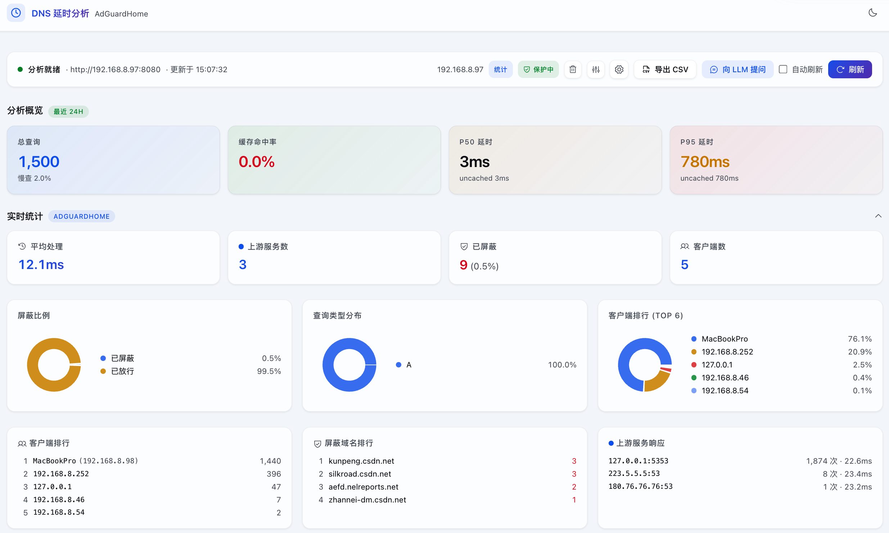
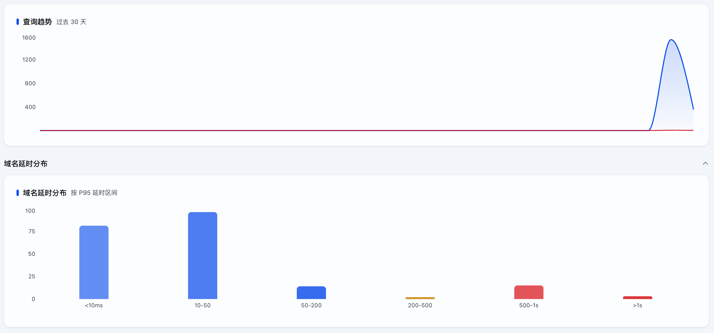
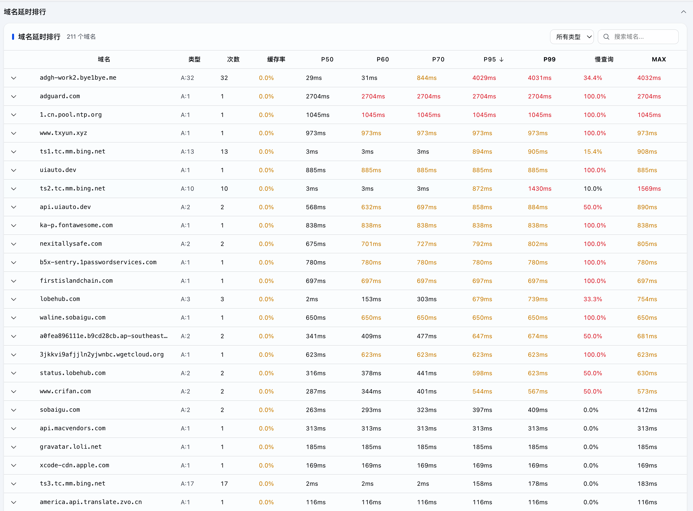

# AdGuardHome DNS 延时分析

<a href="README.en.md"><svg width="16" height="16" viewBox="0 0 24 24" fill="none" stroke="currentColor" stroke-width="2" stroke-linecap="round" stroke-linejoin="round" style="vertical-align: -3px; margin-right: 2px;"><circle cx="12" cy="12" r="10"/><line x1="2" y1="12" x2="22" y2="12"/><path d="M12 2a15.3 15.3 0 0 1 4 10 15.3 15.3 0 0 1-4 10 15.3 15.3 0 0 1-4-10 15.3 15.3 0 0 1 4-10z"/></svg> English</a> · [](https://github.com/xiebaiyuan/adguard-dns-latency/releases)  

基于 AdGuardHome 查询日志，按域名聚合延时分布，定位慢查询和上游瓶颈。

## 截图

  
  


## 快速开始

```bash
git clone https://github.com/xiebaiyuan/adguard-dns-latency.git
cd adguard-dns-latency
npm install
npm run dev
# 后端 http://localhost:3080
# 前端 http://localhost:5173
```

打开浏览器，点击 ⚙️ 填入 AdGuardHome 地址、用户名、密码，点击刷新即可。

也可用 Docker：

```bash
docker run -d --name adguard-dns-latency \
  -p 3080:3080 \
  -e ADGH_URL=http://192.168.8.88 \
  -e ADGH_USER=your_username \
  -e ADGH_PASSWD=your_password \
  -e ADGH_SKIP_VERIFY=true \
  xiebaiyuan/adguard-dns-latency:latest
```

## 功能

- **延时分布** — 每个域名 P20 / P50 / P60 / P70 / P80 / P95 / P99 / Max / Avg / Min，可排序筛选
- **缓存感知** — cached / uncached 分开统计，区分真实上游性能与用户体验
- **慢查询分级** — >500ms 慢、>1s 严重、>3s 超时，按域名展示慢查询率
- **上游下钻** — 行内展开查看每个域名的上游服务器延时明细
- **解析结果 + TTL** — 展开详情显示 IP 解析结果和 TTL 范围
- **实时统计** — 屏蔽比例、查询类型、客户端排行、上游响应时间、趋势图
- **深色/浅色模式** — 跟随系统 + 手动切换
- **CSV 导出** — 导出统计摘要或原始日志
- **向 LLM 提问** — 一键复制延时报告给 ChatGPT / Claude

## 架构

```
┌─────────────┐     ┌─────────────┐     ┌──────────────────┐
│ 浏览器 SPA   │────▶│ Fastify 后端  │────▶│  AdGuardHome API  │
│ (Vite+React) │◀────│ + 分析引擎    │◀────│  /control/querylog│
└─────────────┘     └─────────────┘     └──────────────────┘
                         │缓存
                    ┌────▼────┐
                    │ 内存缓存  │
                    └─────────┘
```

前端 Vite + React + shadcn/ui + Recharts。后端 Fastify + TypeScript，8 个 API 端点，内存缓存。

## 环境变量

| 变量 | 说明 | 默认值 |
|------|------|--------|
| `ADGH_URL` | AdGuardHome 地址 | — |
| `ADGH_USER` | 用户名 | — |
| `ADGH_PASSWD` | 密码 | — |
| `ADGH_SKIP_VERIFY` | 跳过 SSL 验证 | `false` |
| `PORT` | 监听端口 | `3080` |
| `HOST` | 监听地址 | `0.0.0.0` |

## 致谢

数据来自 [AdGuardHome](https://github.com/AdguardTeam/AdGuardHome) 查询日志 API。

## 许可证

MIT
