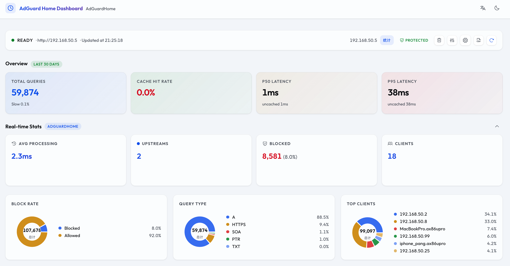
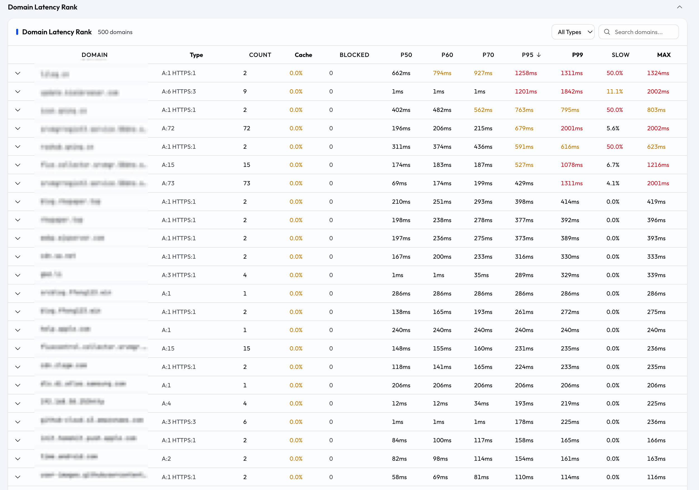
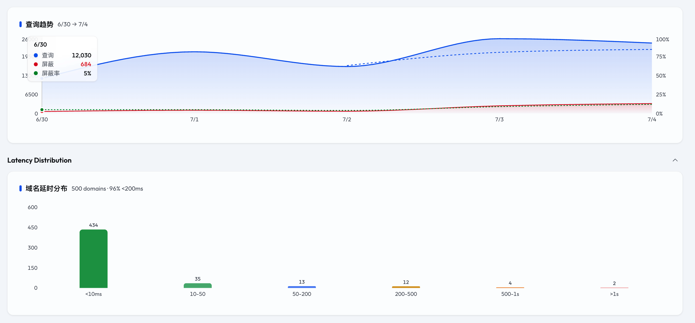
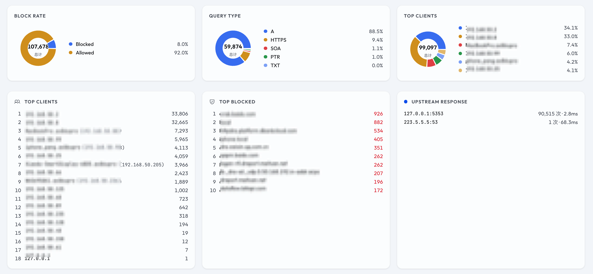

# AdGuard Home Boost

<a href="README.en.md"><svg width="16" height="16" viewBox="0 0 24 24" fill="none" stroke="currentColor" stroke-width="2" stroke-linecap="round" stroke-linejoin="round" style="vertical-align: -3px; margin-right: 2px;"><circle cx="12" cy="12" r="10"/><line x1="2" y1="12" x2="22" y2="12"/><path d="M12 2a15.3 15.3 0 0 1 4 10 15.3 15.3 0 0 1-4 10 15.3 15.3 0 0 1-4-10 15.3 15.3 0 0 1 4-10z"/></svg> English</a> · [中文](README.md)

**AdGuard Home 增强型管理面板** — 分析 DNS 延时、实时监控流量、管理 DNS 设置，一个页面全搞定。

[](https://github.com/xiebaiyuan/adguard-home-boost/releases)     

## 📸 截图

  
  
  


---

## 🚀 快速开始

```bash
git clone https://github.com/xiebaiyuan/adguard-home-boost.git
cd adguard-home-boost
npm install
npm run dev
# 后端 → http://localhost:3080
# 前端 → http://localhost:5173
```

打开 `http://localhost:5173`，点击 ⚙️ 图标填入 AdGuard Home 地址、用户名、密码，点击刷新即可。

**或者用 Docker：**

```bash
docker run -d --name adguard-home-boost \
  -p 3080:3080 \
  -e ADGH_URL=http://192.168.8.88 \
  -e ADGH_USER=your_username \
  -e ADGH_PASSWD=your_password \
  -e ADGH_SKIP_VERIFY=true \
  xiebaiyuan/adguard-home-boost:latest
```

---

## ✨ 功能

### 📊 DNS 延时分析
- **按域名聚合** — P20 / P50 / P60 / P70 / P95 / P99 / Max / Avg / Min，可排序筛选
- **缓存感知统计** — cached / uncached 分开统计，区分真实上游性能与客户端体验
- **慢查询分级** — >500ms 慢、>1s 严重，按域名展示慢查询率与严重率
- **延时分布热力图** — 绿→黄→红色阶柱状图，一眼看清域名 P95 分布
- **查询趋势图** — 双 Y 轴（查询数 + 屏蔽率），3 日移动平均平滑曲线

### 🎛️ DNS 管理
- **保护开关** — 一键暂停/恢复 DNS 保护，乐观更新 UI 无需等待 API
- **安全浏览 & 家长控制** — 开关控制，即时生效
- **DNS 重写** — 管理自定义 DNS 重写规则
- **过滤器管理** — 添加/启用/禁用/删除过滤器订阅
- **自定义规则** — 编辑自定义过滤规则
- **维护操作** — 重置统计、清空查询日志、清除 DNS 缓存

### 📈 实时统计
- **屏蔽比例环图** — 显示总数与百分比
- **查询类型分布** — A / AAAA / PTR / HTTPS 等类型占比
- **客户端排行** — 显示来源 IP 和设备名、查询次数
- **屏蔽域名排行** — 被拦截最多的域名
- **上游服务响应** — 各上游的响应次数与平均耗时

### 🔍 域名下钻
- **客户端来源** — 展开后显示哪些设备（IP + 名称）在查询该域名
- **拦截规则识别** — 被拦截的查询标注规则来源
- **上游明细** — 每个 DNS 上游的查询次数和平均耗时
- **解析结果 + TTL** — IP 解析记录与 TTL 范围
- **最近查询日志** — 最近 20 条查询记录，可导出 CSV

### 🌐 国际化
- **中英文切换** — 浏览器自动检测 + Header 手动切换
- **深色/浅色模式** — 跟随系统 + 手动切换，过渡动画同步

### 🏎️ 体验优化
- **分析概览 KPI** — 总查询、缓存命中率、P50/P95 延时，永久布局无跳动
- **多 Profile 配置** — 保存多组 AdGuard Home 连接，快速切换
- **时间范围** — 支持 24h / 7 天 / 30 天分析窗口
- **首屏淡入** — 页面挂载时从透明平滑出现
- **CSV 导出** — 导出统计摘要或原始查询日志
- **实时统计懒加载** — Recharts 图表只在展开时下载
- **内容骨架屏** — 加载中 shimmer 占位，数据就绪后淡入
- **缓存复用** — 5 分钟内刷新页面不复抓 AdGuard Home 日志，低功耗设备不升温

---

## 🏗️ 架构

```
┌─────────────┐     ┌─────────────┐     ┌──────────────────┐
│ 浏览器 SPA   │────▶│ Fastify 后端  │────▶│ AdGuardHome API  │
│ (Vite+React) │◀────│ + 分析引擎    │◀────│ /control/querylog│
└─────────────┘     └─────────────┘     └──────────────────┘
                         │ 内存缓存
                    ┌────▼────┐
                    │ 5 分钟 TTL │
                    └─────────┘
```

**前端：** Vite + React + Tailwind v4 + Recharts + Phosphor Icons  
**后端：** Fastify + TypeScript，8 个 API 端点，进程内存缓存

---

## ⚙️ 环境变量

| 变量 | 说明 | 默认值 |
|------|------|--------|
| `ADGH_URL` | AdGuard Home 地址 | — |
| `ADGH_USER` | 用户名 | — |
| `ADGH_PASSWD` | 密码 | — |
| `ADGH_SKIP_VERIFY` | 跳过 SSL 验证 | `false` |
| `PORT` | 监听端口 | `3080` |
| `HOST` | 监听地址 | `0.0.0.0` |

---

## 💖 致谢

数据来自 [AdGuard Home](https://github.com/AdguardTeam/AdGuardHome) — 优秀的开源网络广告与跟踪器拦截工具。

## 🌐 友情链接

[Linux.Do](https://linux.do/) — 技术氛围浓厚的开源社区，欢迎大家加入。

---

## 📄 许可证

MIT © xiebaiyuan
